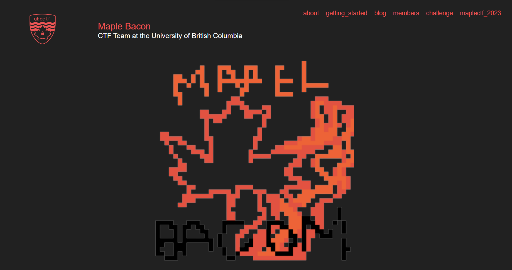
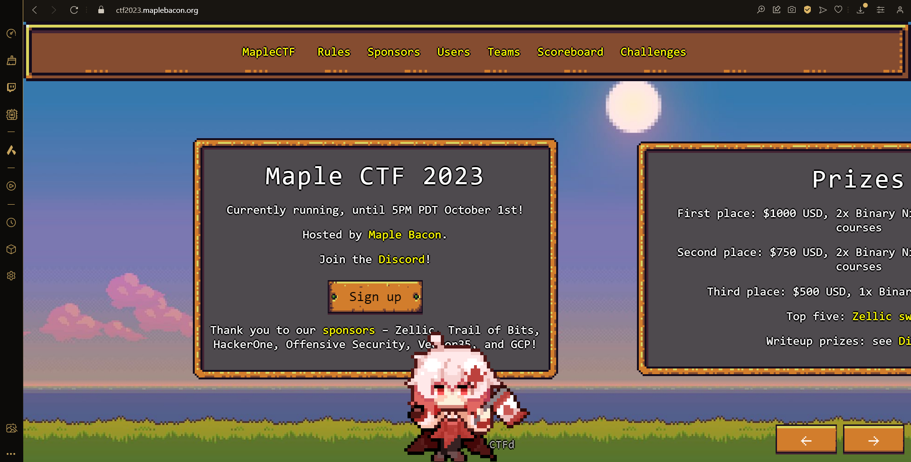

### Practice Google and Maple Capture the Flag Writeup (Sandbox and Misc) - <3

[](https://www.mathworks.com) [](https://img.shields.io/badge/C++-00599C?style=flat-square&logo=C%2B%2B&logoColor=white)




## Challenge description

“Green grass breaks through snow. Artemis pleads for my help. I am so cool.” - Artemis Packet Tracer

In this challenge we can execute an arbitrary payload in a custom seccomp +
namespace sandbox.

The flag is also written to a System V shared memory segment (with the
key=0xf7a6). Bypassing seccomp restrictions is enough to read the flag, as IPC
namespace is not used.

## Intended solution

Namespaces are set up as the first step of creating the sandbox. Mount namespace
is almost empty with just a fresh "/proc" instance.

After that process is forked again into an init process and a sandboxee process.

Sandboxee process:

1.  applies a tight seccomp policy (open/read/write/lseek/exit)
2.  runs our payload

Init process:

1.  iterates over fd = 0..4096 and closes them
2.  applies a tight seccomp policy (waitid/exit)
3.  waits for the child (sandboxee) process

We can notice that there is no other synchronization between sandboxee and init
except of the waitid. So our payload might get to run before init process
applies its seccomp policy. If we take over init process before seccomp policy
is applied, we get code execution without syscall filtering.

Getting RIP control in init is easy by just overwriting the return address of
CloseFds in /proc/1/mem. We don't really need to guess/read the stack address as
the processes are just forked, so we can calculate it from the stack pointer we
have in the payload. Helpfully our payload is also mapped before the fork so no
need for a ROP chain, we can jump straight into some part of the payload for the
second stage. By getting code exec early in the init process we can bypass
seccomp restriction and thus read the flag.

Remaining problem is that the stdout will likely already be closed, so we either
have to pull the read flag into sandboxee process by means of /proc/1/mem or
just recreate stdout in init process using pidfd_open/pidfd_getfd.

### Solution Exploit in Pseudocode

```c++
stage1:
   // launch stage2 in init process before it applies seccomp
   fd = open("/proc/1/mem", O_RDWR)
   stage2_addr = &stage2
   write(fd, stage2_addr, &$RSP[return_address_offset])
   exit(0)
stage2:
   // recreate stdout
   pidfd = pidfd_open(2, 0)
   stdout = pidfd_getfd(pidfd, 1, 0)
   // read the flag
   shmid = shmget(0xf7a6, 128, 0)
   flag = shmat(shmid, 0, 0)
   write(stdout, flag, 128)
   exit(0)
```


</br>
</br>





## Challenge description

The name of the game is simple. It's love. They say opposites attract. You know like North and South, Hot and Cold, etc. The same is said to be true for parity too, the odd (the ones) and even DWORDS (the zeroes) have always had quite steamy and passionate relationships.

Historically speaking, tradition was paramount for this species. The zeroes scour the world in hopes of find their special One. (Where do you think the saying comes from? duh.) However, we are in the 21st century and must adapt to the new.

So, we made an entire reality TV show about it. The premise is simple: Screw tradition, in this show, only the Ones are allowed to court the zeroes.

Stay tuned for the most drama-filled season of Maple Island as of yet with even more tears, arguments, and passionate moments than ever before. Will every match made in Maple heaven be stable?

Maple Island streaming next month on MapleTV!

But wait, lucky viewers have a chance to catch exclusive early-access content if they can solve the following puzzle below and text the answer to 1-800-MAPLE-1337.

Author: hiswui

nc maple-island.ctf.maplebacon.org 1337
